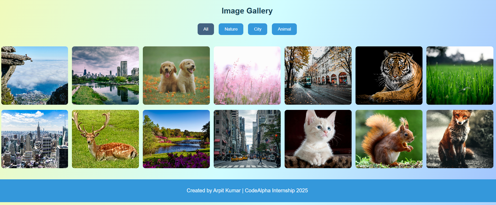

# Task 1 – Image Gallery

This project is part of my CodeAlpha Internship.

## 📌 Description
This is a responsive image gallery website created using HTML, CSS, and JavaScript.  
Users can view multiple high-quality images in a clean gallery layout.

## 🛠️ Technologies Used
- HTML5
- CSS3
- JavaScript

## 📸 Project Screenshot

## 🚀 How to Run the Project
1. Download the project
2. Open `index.html` in any browser

## 🎥 Demo Video
LinkedIn Video Link: 
https://www.linkedin.com/posts/arpit-kumar-web_codealpha-frontenddevelopment-webdevelopment-activity-7392129324264460289-FHMH?utm_source=share&utm_medium=member_desktop&rcm=ACoAAF93ceMBMGuqu1lC-4qcaWgf1lh8wvt3CA0
