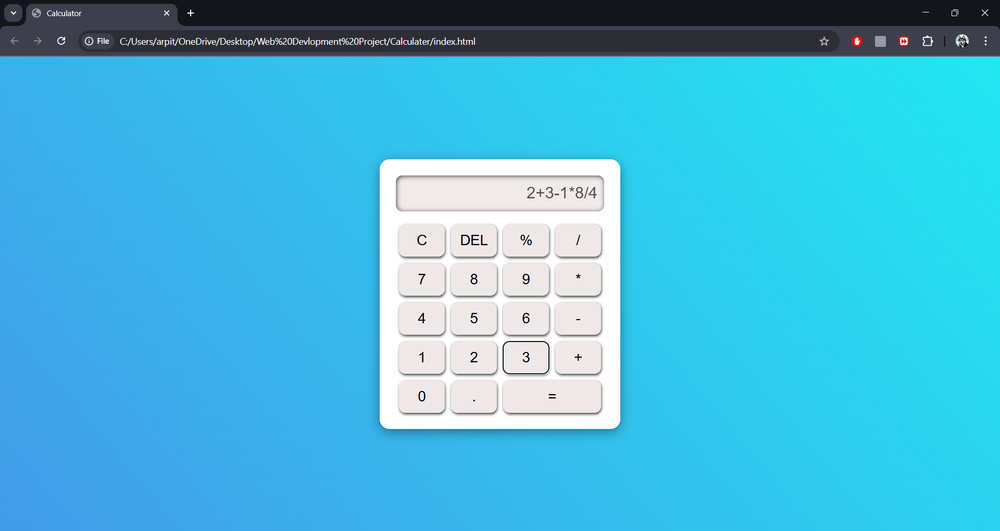

# Task-2 - Calculator

## 📝 Description
This project is a simple and interactive calculator built using HTML, CSS, and JavaScript.  
It supports basic arithmetic operations like addition, subtraction, multiplication, and division.

## 🚀 Technologies Used
- HTML5
- CSS3
- JavaScript

## 📸 Project Screenshot

## 🧩 How to Run the Project
1. Download the project
2. Open `index.html` in any browser

## 🎥 Demo Video (LinkedIn)
https://www.linkedin.com/posts/arpit-kumar-web_codealpha-frontenddevelopment-internship-activity-7391403977906479104-fVe5?utm_source=share&utm_medium=member_desktop&rcm=ACoAAF93ceMBMGuqu1lC-4qcaWgf1lh8wvt3CA0
