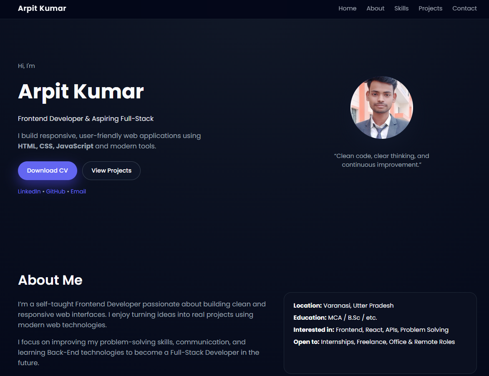
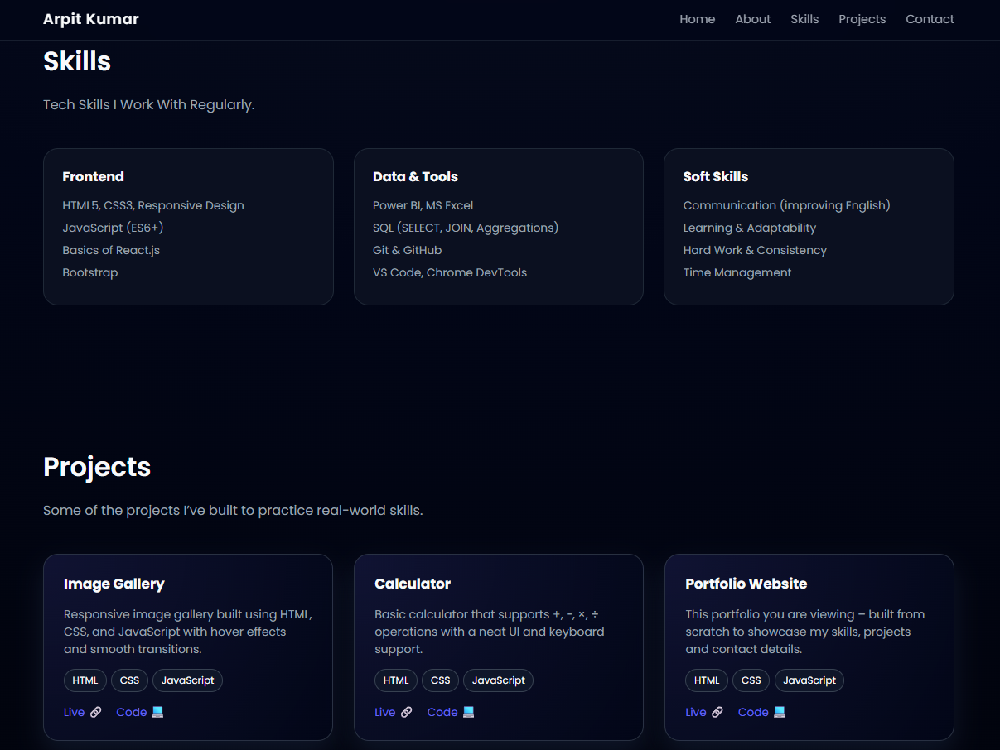
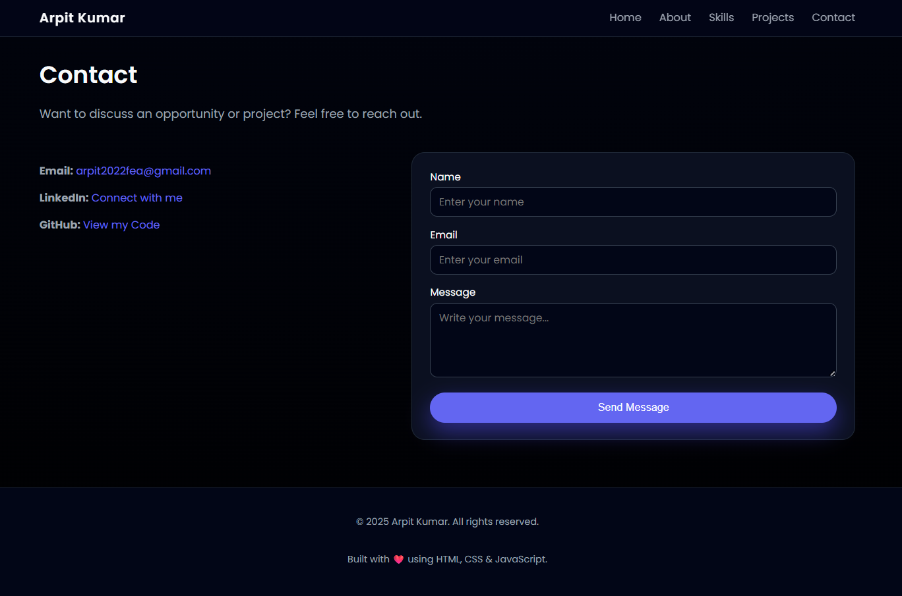

# Task 3 – Portfolio Website

This project is part of my **CodeAlpha Frontend Internship**.

It is a **personal portfolio website** built using HTML, CSS, and JavaScript to showcase my skills, projects, and contact details.

---

## ✨ Features

- Clean and modern single-page portfolio layout
- Sections for **About**, **Skills**, **Projects**, and **Contact**
- Responsive design for desktop and mobile screens
- Smooth scrolling navigation & mobile-friendly navbar
- Working **Contact Form** integrated with **EmailJS**
- External links to **LinkedIn**, **GitHub**, and **Email**

---

## 🧰 Tech Stack

- **HTML5** – Structure of the page
- **CSS3** – Styling, layout, responsive design
- **JavaScript (ES6+)** – Navbar, smooth scroll, contact form, EmailJS
- **EmailJS** – To send messages directly from the contact form
- **Git & GitHub** – Version control and hosting

---

## 📸 Project Screenshot





---

## 🎥 Demo Video (LinkedIn)

https://www.linkedin.com/posts/arpit-kumar-web_codealpha-portfolio-webdevelopment-activity-7400203475009060864-W6yN?utm_source=share&utm_medium=member_desktop&rcm=ACoAAF93ceMBMGuqu1lC-4qcaWgf1lh8wvt3CA0

---

## 🌐 Live Demo

- **Live Demo:** https://arpit27112000.github.io/codealpha_tasks/Task3/
- **GitHub Repository:** https://github.com/Arpit27112000/codealpha_tasks/tree/main/Task3

---

## 📁 Project Structure

```bash
Task3/
  ├── index.html       # Main portfolio page
  ├── style.css        # All styling
  ├── script.js        # Navbar, scroll, contact form + EmailJS
  ├── Screenshot1.png   # Portfolio preview image
  ├── Screenshot2.png
  ├── Screenshot3.png
  ├── files/            # Resume
  ├── images/           # Profile image
  └── README.md        # Project documentation (this file)

```
